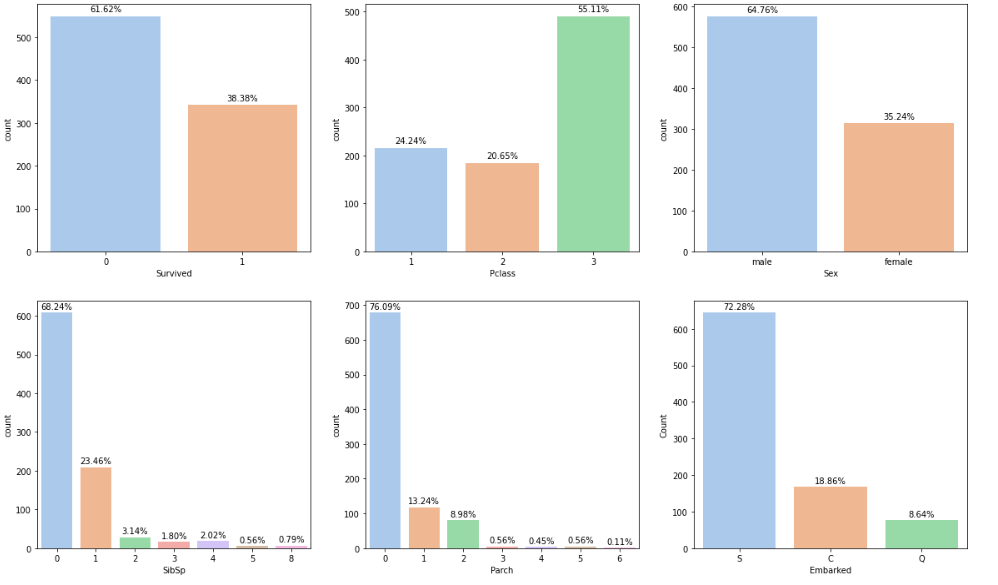
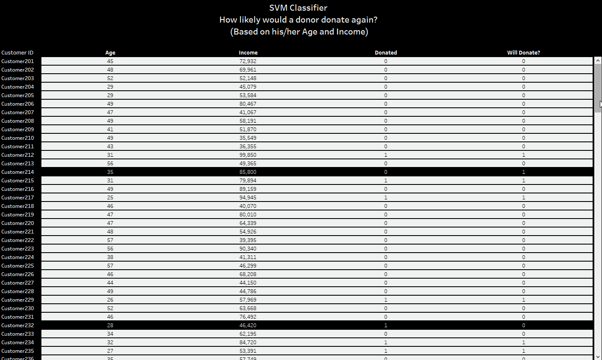
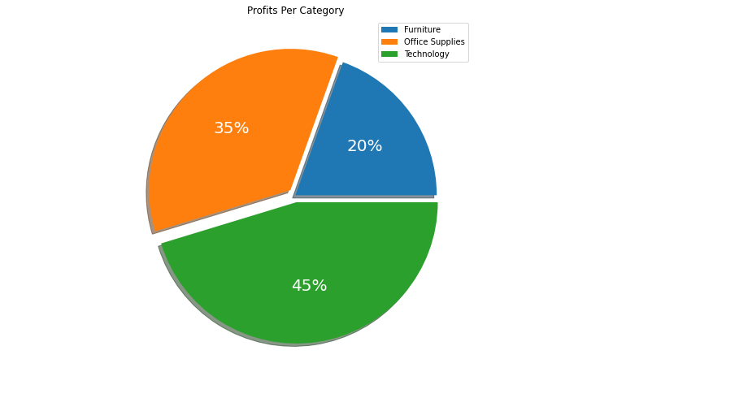

# About:

### I am a Data Scientist, been working with data for 2 years and as time goes, my passion grows, always pursuing challenges. 
  - 🔭 I am a content creator on [Medium][Medium]
  - 🌱 I’m currently learning everything 
  - 🥅 2021 Goals Are: 5 travels, 20 books, and speak Russian
  - ⚡ Fun fact: I worked in over 10 different fields and wrote 2 books 🤣
  - 👯 Art Blogger, Chess player, Classical music listener, and Yo toco la guitarra
  
# Languages & Skills:
- [Python](https://github.com/taricov?tab=repositories)         
- [R](https://github.com/taricov/R_Projects)
- [SPSS]()
- [SQL](https://www.kaggle.com/taricov/sql-snippets-bike-share-dataset)
- [JavaScript](https://github.com/taricov?tab=repositories)
- [CSS/Scss](https://codepen.io/taricov/pens/public?cursor=ZD0xJm89MCZwPTEmdj01MDM4MDQ5Mg==)
- [Observable]()
- [Tableau](https://github.com/taricov/Tableau_Projects)
- [PowerBI](https://app.powerbi.com/groups/me/reports/cc818e03-c473-4d97-994c-be7c8ac778a6?ctid=0b6fac1e-c1ac-4214-bd79-eb9321e7de42&pbi_source=linkShare)
- [Excel]()
  <!-- - [Java](https://github.com/taricov?tab=repositories) -->
 
# Certificates:
- Google Data Analytics Certificate
- FMVA
- Predictive Machine Learning.
- For More [Visit](https://www.linkedin.com/in/taricov/)

# Machine Learning Projects:

### 1.[ Python: Titanic Survivors Classifier](https://github.com/taricov/Python_Titanic_Survivors_Classificier)
   - Keywords: [Classfication, ML, Decision Tree, Logistic Regression, Gradiant Boost, MLP, SVC]()
   - *Used libs: Pandas, Numpy, Sklearn, Seaborn, Statsmodels*

> It's more than common to find this popular dataset about the Titanic disaster in ML portfolios, but I wanted this project to be more than basic, studying classification models and understanding how to tweak their vital hyperparameters, however, I had a further big question to answer. **How likely could other factors determine someone's death other than the main threat to their life?** 'cause all Titanic passengers were on the same ship, exposed to the same situation, likely to all die or all survive. the interesting part is that some of them died and some survived, so the life-threatening situation wasn't enough to determine one's destiny, there must be other determinants that need investigation to understand some other questions that could seem crazy or even ironic, such as 'Could your family size carry your death verdict?!!' or maybe 'Could there be a relation between your daily protein intake percentage to your survival liklihood?!', most ironically "Could nature destined your inevitable death when you first born as a male/female?!", etc.  

### 2.[ Python: Insurance dataset classifier](https://github.com/taricov/Python_Insurance_Predictive_Regression)
  - Keywords: [Classfication, ML, Decision Tree, Logistic Regression, Gradiant Boost, MLP, SVC]()
  - *Used libs: Pandas, Numpy, Sklearn, Seaborn, plotly*

> This project is about insurance dataset, exploring the insured and how often they could claim charges for their insurance policies, especially those how dangering their lives or at least threatening their well-being in some ways, maybe a habit of smoking, a level of frequency of having sex (how many children do they have?), or even where they live or how old they are- is a major factor in encouraging them to do so.
> It's very interesting to explore and have fun with such a case and to learn more about human behavior when it comes to claiming what could be righteously theirs. 

### 3.[ R: SVM classifier using R and Tableau](https://github.com/taricov/R_SVM_Classifier)
   - Keywords: [R, Data Analysis, EDA, Data Visualization, Business Intelligence, Machine Learning, SVM]()
   - *Used libs: Rbase, e1071, ggplot2, Rserve*

> In this project, I trained an SVM model to classify donors (By making a buy) and to answer the question "How likely would a donor donate the next time?" based on his/her Age and Income. I used R for that task, trained the model and when I came to a solution, I integrated R with Tableau to benefit from its powerful visuals, connecting both on an external server.  

### 4.[ Python: Historical Sales Data Analysis](https://www.kaggle.com/taricov/python-sales-sheet-analysis)
   - Keywords: [Data Analysis, EDA, Data Visualization, Business Intelligence]()
   - *Used libs: Pandas, Numpy, Seaborn, Matplotlib*

> That project was early on my journey and it's about various small tasks to explore the business based on its sales dataset. The main driver here was the profitability, while my main question was: "What's the main revenue pipeline?". I had some other sub-questions to examine certain business aspects like Shipment mode, Geographical impact on sales, and profitability across different departments.  

# Data-Based Web Apps:

- [ STREAMLIT: Stock Historical Data](https://github.com/taricov/Python_Stock_Web_App)
<!--  - [ R Shiny: ]()  -->
- [ STREAMLIT: NFL Rushing Web App](https://github.com/taricov/Python_NFL_Data_App) 
- [ DASH: Stock Closing Price Timeline](https://github.com/taricov/DASH_Interactive_Stocks_Web_App) 
- [ STREAMLIT: Cryptocurrency Web App](https://github.com/taricov/Python_Cryptocurrency_App) 

# Others:

- [ R: Scraping and visualizing data using](https://github.com/taricov/R_scraping_viz_data) 
- [ Tableau: Sales Volume Dashboard](https://github.com/taricov/Tableau_Sales_Dashboard) 
- [ JS: Weather App](https://taricov.github.io/JS_Weather_App/) 
- [ Tableau: Attrition Dashboard](https://github.com/taricov/Tableau_Attrition_Dashboard)
- [ SQL: Joining Tables From The Indian League Dataset](https://www.kaggle.com/taricov/sql-snippets-tabular-data-joining-value-mapping) 
- [ Tableau: Retail Analysis - Walmart](https://github.com/taricov/Tableau_Retail_Analysis_Dashboard) 
- [ Tableau: Bank Customer Analysis Dashboard](https://github.com/taricov/Tableau_Bank_Customer_Analysis_dashboard) 
- [ SQL: Bike Share Dataset](https://www.kaggle.com/taricov/sql-snippets-bike-share-dataset) 
- [ PowerBI: Financial Model/Senario Analysis](https://app.powerbi.com/groups/me/reports/cc818e03-c473-4d97-994c-be7c8ac778a6?ctid=0b6fac1e-c1ac-4214-bd79-eb9321e7de42&pbi_source=linkShare) 

## 📕 Latest Blog Posts:

<!-- BLOG-POST-LIST:START -->
- [MAYA .. How being Advanced CAN’T help your product being Accepted!](https://medium.com/geekculture/maya-how-being-advanced-cant-help-your-product-being-accepted-8bcc7ad97da2?source=rss-35f5c1b349a7------2)
- [Attrition! Why should you track it with a dashboard that STUNS?!](https://medium.com/geekculture/attrition-why-should-you-track-it-with-a-dashboard-that-stuns-2e50663f0e21?source=rss-35f5c1b349a7------2)
- [How a BIG company would store its data?](https://medium.com/geekculture/how-a-big-company-would-store-its-data-3cca5009562e?source=rss-35f5c1b349a7------2)
- [USD vs EGP — Stats on currency exchange over 17 years](https://taric-ov.medium.com/usd-vs-egp-stats-on-currency-exchange-over-17-years-5dd10517961d?source=rss-35f5c1b349a7------2)
- [BizCase (2): When Uber exposed ethics](https://taric-ov.medium.com/bizcase-2-when-uber-exposed-ethics-b075dcdb7922?source=rss-35f5c1b349a7------2)
<!-- BLOG-POST-LIST:END -->

## Contact Me:

[][website]
[][Medium]
[][linkedin]
[][instagram]

[website]: https://myweb.com
[Medium]: https://taric-ov.medium.com/
[instagram]: https://www.instagram.com/taric.ov/
[linkedin]: https://www.linkedin.com/in/taricov/
